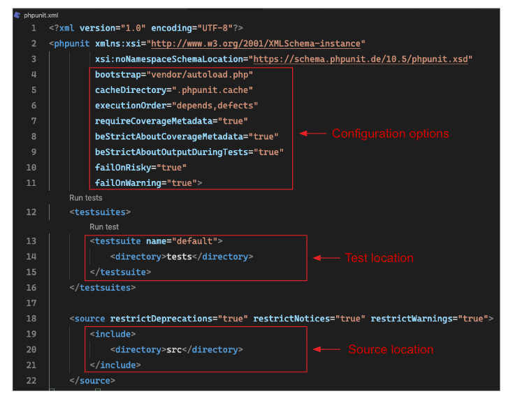
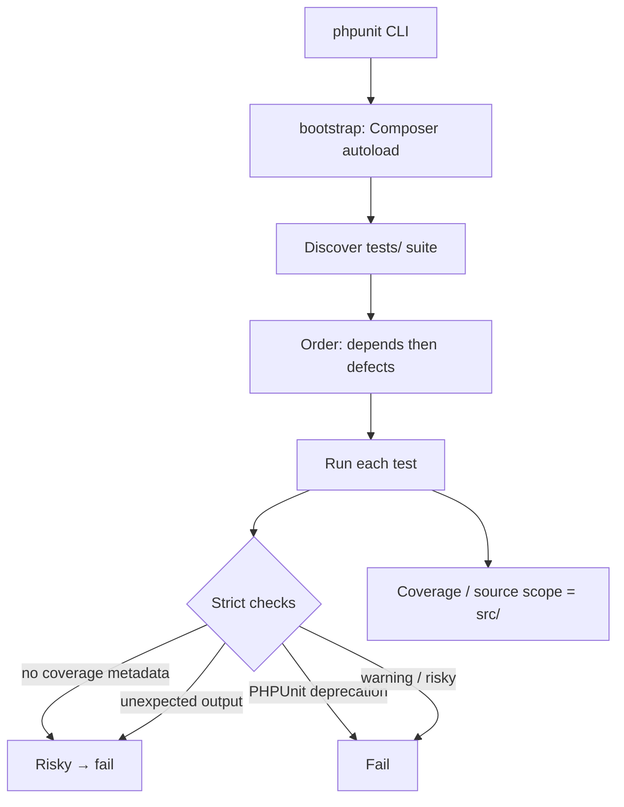
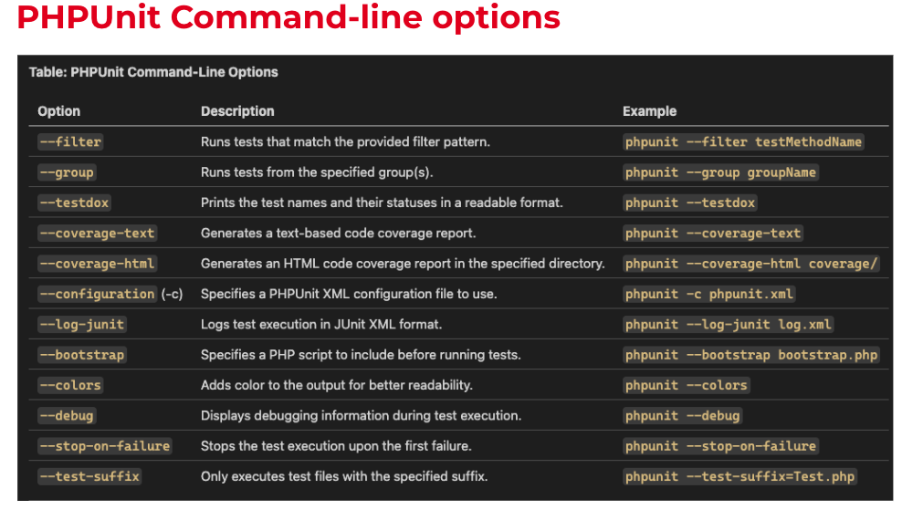

# phpunit-demo

A demo project to explain **PHPUnit** — unit testing in a modern PHP 8.3 environment, fully containerized with Docker.

This guide walks you through the project from an empty directory to a green test suite:

1. [Prerequisites](#prerequisites)
2. [Project layout](#project-layout)
3. [Docker setup](#1-docker-setup)
4. [Composer: init, autoload & install](#2-composer-init-autoload--install)
5. [PHPUnit: install & configure](#3-phpunit-install--configure)
6. [phpunit.xml explained](#phpunitxml-explained)
7. [Running the tests](#4-running-the-tests)
8. [Troubleshooting](#troubleshooting)

---

## Prerequisites

- [Docker](https://docs.docker.com/get-docker/) and Docker Compose v2 (`docker compose`, not the legacy `docker-compose`)
- Git

Everything else (PHP, Composer, PHPUnit, extensions) lives **inside the container** — you do not need PHP installed on your host.

---

## Project layout

```text
phpunit-demo/
├── Dockerfile              # PHP 8.3 CLI image + extensions + Composer
├── docker-compose.yml      # Defines the `php` service
├── composer.json           # Package metadata, autoloading, dev dependencies
├── phpunit.xml             # PHPUnit configuration
├── src/                    # Application code (namespace: Demo\App)
│   ├── MathHelper.php
│   └── StringUtilities.php
└── tests/                  # Test suite (mirrors src/)
    ├── MathHelperTest.php
    └── StringUtilitiesTest.php
```

The PSR-4 mapping is `Demo\App\ => src/`, so a class `Demo\App\MathHelper` must live at `src/MathHelper.php`.

---

## 1. Docker setup

The environment is defined by two files.

**`Dockerfile`** — builds a PHP 8.3 CLI image with the `pdo`/`pdo_mysql` extensions, the [`pcov`](https://github.com/krakjoe/pcov) coverage driver, and Composer:

```dockerfile
FROM php:8.3-cli-bookworm

RUN apt-get update && apt-get install -y \
    zip unzip git \
    $PHPIZE_DEPS \
    && docker-php-ext-install pdo pdo_mysql \
    && pecl install pcov \
    && docker-php-ext-enable pcov \
    && apt-get purge -y --auto-remove $PHPIZE_DEPS \
    && rm -rf /var/lib/apt/lists/*

RUN curl -sS https://getcomposer.org/installer | php -- --install-dir=/usr/local/bin --filename=composer

WORKDIR /app
COPY . /app
```

**`docker-compose.yml`** — defines a single long-running `php` service. The bind mount (`.:/app`) means edits on your host are instantly reflected inside the container, so you don't rebuild to run tests:

```yaml
services:
  php:
    container_name: phpunit_demo
    build: .
    volumes:
      - .:/app
    command: tail -f /dev/null
```

### Build & start

```bash
# Build the image and start the container in the background
docker compose up -d --build

# Confirm the runtime
docker compose exec php php --version   # => PHP 8.3.x
```

### Working inside the container

All subsequent commands run **inside** the `php` service. You can either prefix each command with `docker compose exec php ...`, or open an interactive shell into the running container by its name (`phpunit_demo`, as defined by `container_name` in `docker-compose.yml`):

```bash
docker exec -it phpunit_demo bash
```

### Tearing down

```bash
docker compose down --volumes --remove-orphans
```

---

## 2. Composer: init, autoload & install

[Composer](https://getcomposer.org/) is PHP's dependency manager. It also generates the PSR-4 autoloader that maps namespaces to files.

### Creating `composer.json` from scratch (`composer init`)

If you were starting a brand-new project, you'd run the interactive generator inside the container:

```bash
docker compose exec php composer init
```

It prompts for the package name, description, license, and dependencies, then writes a `composer.json`. This repo already ships one:

```json
{
    "name": "entrata/phpunit-demo",
    "description": "phpunit demo",
    "type": "project",
    "license": "MIT",
    "autoload": {
        "psr-4": {
            "Demo\\App\\": "src/"
        }
    },
    "authors": [
        {
            "name": "Manish Choudhary"
        }
    ],
    "minimum-stability": "dev",
    "require-dev": {
        "phpunit/phpunit": "12.5.x-dev"
    }
}
```

Key sections:

- **`autoload.psr-4`** — maps the `Demo\App\` namespace prefix to the `src/` directory. This is why `new Demo\App\MathHelper()` resolves to `src/MathHelper.php` with no manual `require`.
- **`require-dev`** — development-only dependencies (PHPUnit), excluded from production installs run with `--no-dev`.

### Installing dependencies

```bash
# Install everything defined in composer.json / composer.lock
docker compose exec php composer install
```

This creates the `vendor/` directory (including `vendor/autoload.php` and `vendor/bin/phpunit`).

Useful related commands:

```bash
# Regenerate the autoloader after changing namespaces or the psr-4 map
docker compose exec php composer dump-autoload

# Add a new dev dependency later
docker compose exec php composer require --dev <vendor/package>
```

> **Tip:** `vendor/` should be git-ignored. Commit `composer.json` **and** `composer.lock` so installs are reproducible.

---

## 3. PHPUnit: install & configure

### Installing the PHPUnit package

PHPUnit is declared under `require-dev`, so `composer install` (above) already pulls it in. To add it to a fresh project yourself:

```bash
docker compose exec php composer require --dev phpunit/phpunit
```

Verify the binary:

```bash
docker compose exec php ./vendor/bin/phpunit --version
```

### Configuration (`phpunit.xml`)

PHPUnit reads its configuration from `phpunit.xml` in the project root:

```xml
<?xml version="1.0" encoding="UTF-8"?>
<phpunit xmlns:xsi="http://www.w3.org/2001/XMLSchema-instance"
         xsi:noNamespaceSchemaLocation="vendor/phpunit/phpunit/phpunit.xsd"
         bootstrap="vendor/autoload.php"
         cacheDirectory=".phpunit.cache"
         executionOrder="depends,defects"
         requireCoverageMetadata="true"
         beStrictAboutCoverageMetadata="true"
         beStrictAboutOutputDuringTests="true"
         displayDetailsOnPhpunitDeprecations="true"
         failOnPhpunitDeprecation="true"
         failOnRisky="true"
         failOnWarning="true">
    <testsuites>
        <testsuite name="default">
            <directory>tests</directory>
        </testsuite>
    </testsuites>

    <source ignoreIndirectDeprecations="true" restrictNotices="true" restrictWarnings="true">
        <include>
            <directory>src</directory>
        </include>
    </source>
</phpunit>
```

At a glance, the configuration breaks down into three concerns — the root-level **configuration options**, the **test location**, and the **source location** used for coverage:



A full attribute-by-attribute walkthrough is in [phpunit.xml explained](#phpunitxml-explained) below.

### Declaring coverage metadata (PHPUnit 10+/12)

Because `requireCoverageMetadata` is enabled, each test class must declare its coverage target. **PHPUnit 12 ignores the legacy `/** @covers */` doc-block** — use the attribute API instead:

```php
<?php

use PHPUnit\Framework\Attributes\CoversClass;
use PHPUnit\Framework\TestCase;
use Demo\App\MathHelper;

#[CoversClass(MathHelper::class)]
class MathHelperTest extends TestCase
{
    public function testMultiply()
    {
        $result = (new MathHelper())->multiply(3, 4);
        $this->assertEquals(12, $result);
    }
}
```

---

## phpunit.xml explained

This is a **strict PHPUnit 12** config — the kind you want in a real codebase so flaky, noisy, or under-documented tests fail the build instead of sliding through.

### Root `<phpunit>` attributes

#### Schema / XML plumbing

| Attribute | Value | What it does |
| --- | --- | --- |
| `xmlns:xsi` | W3C schema-instance URI | Declares the XML Schema Instance namespace so editors/IDEs can validate the file. |
| `xsi:noNamespaceSchemaLocation` | `vendor/phpunit/phpunit/phpunit.xsd` | Points at PHPUnit’s XSD. Autocomplete and validation in the IDE come from this. |

These don’t change runtime behavior; they keep the config valid and editable.

#### `bootstrap="vendor/autoload.php"`

Runs **before any test**. Composer’s autoloader loads so `Demo\App\...` classes resolve without manual `require`.

Without this, every test that touches `src/` would fatal on “class not found.”

#### `cacheDirectory=".phpunit.cache"`

Where PHPUnit stores result/metadata cache (test results, static analysis cache for ordering, etc.).

- Speeds re-runs
- Safe to gitignore
- Delete it if ordering/caching looks stale

#### `executionOrder="depends,defects"`

Controls **run order**:

1. **`depends`** — honor `@depends` / `#[Depends]` so dependents run after their prerequisites
2. **`defects`** — previously failing/risky tests run first on the next run (fail-fast feedback)

Other common values: `default`, `random`, `reverse`, `duration`.  
`depends,defects` is a solid CI default: correctness of dependencies + “fix what broke last time first.”

#### Coverage metadata (strict mode)

**`requireCoverageMetadata="true"`**

Every test must declare coverage intent via attributes/annotations, e.g.:

- `#[CoversClass(...)]` / `@covers`
- `#[DoesNotCover]` / `@coversNothing`

If a test has none → **risky** (and with the other flags below, that can fail the suite).

**`beStrictAboutCoverageMetadata="true"`**

Goes further: coverage metadata must be **accurate**. Claiming `@covers Foo` while exercising `Bar` (or missing real coverage targets) is treated as a problem.

Together these force intentional coverage documentation — useful for demos and for teams that care about “what this test is supposed to prove.”

#### `beStrictAboutOutputDuringTests="true"`

Any unexpected `echo`, `print`, `var_dump`, or stray output during a test → **risky**.

Keeps the suite clean and catches accidental debug leftovers. Intentional output should go through PHPUnit’s output expectations/APIs, not raw prints.

#### Deprecation / failure policy

**`displayDetailsOnPhpunitDeprecations="true"`**

When PHPUnit itself emits deprecations (API you’re using that will change/remove), print the **details**, not just a count.

**`failOnPhpunitDeprecation="true"`**

Those PHPUnit deprecations **fail the run**. On `12.5.x-dev` this is aggressive but good: you won’t silently accumulate dead APIs.

**`failOnRisky="true"`**

Risky tests fail the suite. Risky usually means: no assertions, unexpected output, incomplete coverage metadata, etc. — depending on other strict flags.

**`failOnWarning="true"`**

PHPUnit warnings fail the suite (not just PHP `E_WARNING`). Treat warnings as errors in CI.

**Net effect of this block:** green build = clean, intentional, non-noisy tests.

### `<testsuites>`

```xml
<testsuites>
    <testsuite name="default">
        <directory>tests</directory>
    </testsuite>
</testsuites>
```

| Piece | Meaning |
| --- | --- |
| `<testsuites>` | Container for one or more named suites |
| `name="default"` | Suite label (CLI: `--testsuite default`) |
| `<directory>tests</directory>` | Recursively discover `*Test.php` under `tests/` |

You can add more suites later (`unit`, `integration`) and run them separately.

### `<source>` (code under analysis)

```xml
<source ignoreIndirectDeprecations="true" restrictNotices="true" restrictWarnings="true">
    <include>
        <directory>src</directory>
    </include>
</source>
```

In PHPUnit 10+, `<source>` replaced the old `<coverage><include>` idea for “what is *your* code.”

#### Why it matters

- **Code coverage** is measured against this include set
- **Deprecation/notice/warning filtering** can be scoped to *your* code vs vendor

#### Attributes on `<source>`

| Attribute | Effect |
| --- | --- |
| `ignoreIndirectDeprecations="true"` | Deprecations triggered **indirectly** (e.g. your code calls vendor, vendor triggers a deprecation) are ignored. You only care about deprecations your code causes directly. |
| `restrictNotices="true"` | PHP notices are only considered (for PHPUnit’s reporting/failure behavior) when they originate in included source (`src/`), not deep in vendor. |
| `restrictWarnings="true"` | Same idea for warnings: focus on `src/`, not third-party noise. |

#### `<include><directory>src</directory>`

Only `src/` is “first-party” code for coverage and restricted reporting. `vendor/` and `tests/` are outside that boundary unless you add them.

### Mental model



### Practical takeaway

This config teaches **discipline**, not just “run tests”:

1. Autoload via Composer
2. Cache for speed
3. Smart execution order
4. Every test must declare coverage intent — and correctly
5. No stray output
6. Deprecations, risky tests, and warnings fail CI
7. Analysis/coverage scoped to `src/`, with vendor noise filtered

---

## 4. Running the tests

Run the full suite:

```bash
docker compose exec php ./vendor/bin/phpunit
```

Expected output:

```text
PHPUnit 12.5.x by Sebastian Bergmann and contributors.

Runtime:       PHP 8.3.x
Configuration: /app/phpunit.xml

.......                                                             7 / 7 (100%)

Time: 00:00.002, Memory: 14.00 MB

OK (7 tests, 7 assertions)
```

Other common invocations:

```bash
# Run a single test file
docker compose exec php ./vendor/bin/phpunit tests/MathHelperTest.php

# Run one test method by name
docker compose exec php ./vendor/bin/phpunit --filter testDivideByZero

# Verbose test names (testdox)
docker compose exec php ./vendor/bin/phpunit --testdox

# Generate a code-coverage report (pcov is pre-installed in the image)
docker compose exec php ./vendor/bin/phpunit --coverage-text
docker compose exec php ./vendor/bin/phpunit --coverage-html coverage/
```

### Command-line options reference

The most useful PHPUnit CLI flags. Prefix each with `docker compose exec php ./vendor/bin/phpunit` to run it in this project.

| Option | Description | Example |
| --- | --- | --- |
| `--filter` | Runs tests that match the provided filter pattern. | `phpunit --filter testMethodName` |
| `--group` | Runs tests from the specified group(s). | `phpunit --group groupName` |
| `--testdox` | Prints the test names and their statuses in a readable format. | `phpunit --testdox` |
| `--coverage-text` | Generates a text-based code coverage report. | `phpunit --coverage-text` |
| `--coverage-html` | Generates an HTML code coverage report in the specified directory. | `phpunit --coverage-html coverage/` |
| `--configuration` (`-c`) | Specifies a PHPUnit XML configuration file to use. | `phpunit -c phpunit.xml` |
| `--log-junit` | Logs test execution in JUnit XML format. | `phpunit --log-junit log.xml` |
| `--bootstrap` | Specifies a PHP script to include before running tests. | `phpunit --bootstrap bootstrap.php` |
| `--colors` | Adds color to the output for better readability. | `phpunit --colors` |
| `--debug` | Displays debugging information during test execution. | `phpunit --debug` |
| `--stop-on-failure` | Stops the test execution upon the first failure. | `phpunit --stop-on-failure` |
| `--test-suffix` | Only executes test files with the specified suffix. | `phpunit --test-suffix=Test.php` |



> **Note:** `--group` pairs with the `#[Group('name')]` attribute on a test, and `--colors` is most useful locally — CI logs usually strip ANSI codes, so pass `--colors=never` there.

---

## Troubleshooting

| Symptom | Cause | Fix |
| --- | --- | --- |
| `Class "Demo\App\..." not found` | Namespace doesn't match the PSR-4 map, or autoloader is stale. | Ensure the class namespace matches `composer.json`, then run `composer dump-autoload`. |
| `This test does not define a code coverage target` (risky) | Missing coverage metadata under strict mode. | Add `#[CoversClass(...)]` to the test class (the old `@covers` docblock is ignored in PHPUnit 12). |
| `phpunit: not found` | Dependencies not installed in the container. | Run `docker compose exec php composer install`. |
| Changes not reflected | Editing a stale copy / container not mounting source. | Confirm the `.:/app` volume in `docker-compose.yml`; no rebuild is needed for code changes. |
